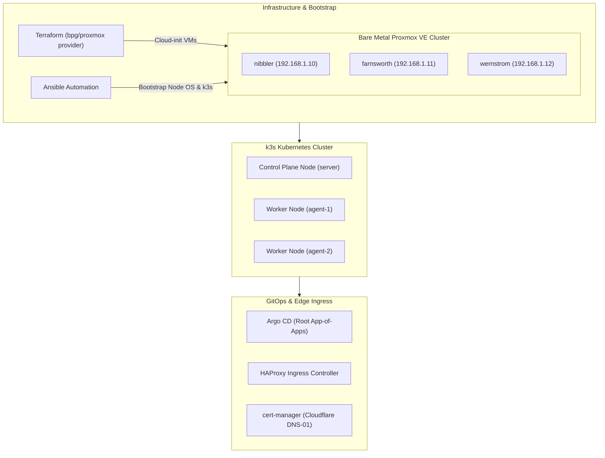

# fleet-platform

> **Zero-Drift Automated Kubernetes Infrastructure on Proxmox VE**

`fleet-platform` is a fully automated, declarative homelab Kubernetes platform. It provisions virtual machine infrastructure on a bare-metal Proxmox VE cluster using Terraform, configures k3s nodes via Ansible, and manages cluster workloads continuously through an Argo CD GitOps pipeline.

The entire infrastructure is designed for **single-script teardown and rebuild harness**, ensuring absolute zero configuration drift.

---

## 🏛️ Architecture & Component Stack



| Layer | Component | Description / Function |
|---|---|---|
| **Hypervisor Cluster** | Proxmox VE 9 | 3-node physical server cluster (`nibbler`, `farnsworth`, `wernstrom`). |
| **Infrastructure as Code** | Terraform | Declarative VM provisioning using the `bpg/proxmox` provider with S3 remote state. |
| **Image Bootstrapping** | Cloud-init | Unattended OS configuration, cloud-image customization (`virt-customize`), unique machine IDs. |
| **Configuration Management** | Ansible | Node preparation, k3s installation, dpkg lock handling, and encrypted parameter injection. |
| **Container Orchestration** | k3s | Lightweight production Kubernetes distribution (1 server node, 2 agent nodes). |
| **Continuous Delivery** | Argo CD | Declarative GitOps deployment utilizing the root "App-of-Apps" pattern. |
| **Ingress Controller** | HAProxy Ingress | High-performance ingress routing for cluster services. |
| **TLS & Certificates** | cert-manager | Automated Let's Encrypt wildcard certificates (`*.wehaveaproblem.net`) via Cloudflare DNS-01. |

---

## 📁 Repository Layout

```text
fleet-platform/
├── README.md                      # Repository documentation & overview
├── NOTES.md                       # Deep technical notes & implementation post-mortems
├── rebuild-cluster.sh             # Single-command end-to-end teardown and rebuild harness
├── ansible.cfg                    # Ansible configuration and inventory settings
├── ansible/                       # Ansible playbooks and modular roles
│   ├── install-cluster-k3s.yml    # Node OS prep & k3s cluster installation
│   ├── install-cluster-argocd.yml # In-cluster Argo CD Helm deployment
│   ├── configure-bootstrap-secrets.yml # Cloudflare API token bootstrap
│   ├── get-cli-kubeconfig.yml     # Kubeconfig extraction and workstation setup
│   ├── inventory/                 # Group variables and host definitions
│   └── roles/                     # Decoupled Ansible roles
├── terraform/                     # Infrastructure as Code
│   ├── main.tf                    # Proxmox VM definitions and cloud-init settings
│   ├── providers.tf               # bpg/proxmox provider configuration
│   └── backend.tf                 # S3 remote state configuration
├── argocd/                        # GitOps application manifests
│   ├── cluster/                   # App-of-Apps root application & target CRDs
│   │   ├── root.yml               # Root Argo CD Application definition
│   │   ├── cert-manager.yml       # cert-manager deployment manifest
│   │   ├── haproxy-ingress.yml    # HAProxy Ingress manifest
│   │   └── cert-manager/          # Cloudflare DNS-01 ClusterIssuers & Certificates
│   └── helm-values/               # Tuned Helm release values
└── helper-artifacts/              # Proxmox Ubuntu cloud-init template build scripts
```

---

## ⚡ Zero-Drift Rebuild Automation

The entire cluster can be destroyed and recreated from scratch with a single command:

```bash
./rebuild-cluster.sh
```

### What `rebuild-cluster.sh` Orchestrates:
1. **Infrastructure Teardown**: Destroys existing VMs via `terraform destroy -auto-approve`.
2. **VM Provisioning**: Clones cloud-init templates on Proxmox and applies network configurations via `terraform apply`.
3. **OS Synchronization**: Waits for first-boot OS unattended upgrades to complete (`cloud-init status --wait`).
4. **k3s Cluster Bootstrap**: Runs Ansible playbooks to install k3s server and agent nodes with encrypted tokens.
5. **Kubeconfig Retrieval**: Fetches and sanitizes cluster `kubeconfig` to local workstation.
6. **Secret Ingestion**: Injects Cloudflare DNS-01 API secrets into Kubernetes prior to GitOps synchronization.
7. **Argo CD Bootstrap**: Deploys Argo CD and registers the root `App-of-Apps` manifest for continuous workload reconciliation.

---

## 🔒 Security & Secret Management

- **Zero Hardcoded Secrets**: All sensitive values (k3s join tokens, Argo CD admin credentials, Cloudflare API keys) are stored in **Ansible Vault** encrypted files.
- **Automated Gitleaks Auditing**: Repository history is scanned continuously with `gitleaks` and protected via pre-commit hooks (`.git/hooks/pre-commit`).
- **TLS Automation**: Full HTTPS encryption with automated Let's Encrypt wildcard certificate renewals via Cloudflare DNS-01 challenges.

---

## 📖 Deep-Dive Documentation & Notes

- **Detailed Implementation Diary**: Read [`NOTES.md`](NOTES.md) for architectural trade-offs, bug post-mortems, and cloud-init troubleshooting.
- **Engineering Blog**: Technical deep dives on this platform are published at [bouligny.dev/fleet-platform](https://bouligny.dev/fleet-platform).